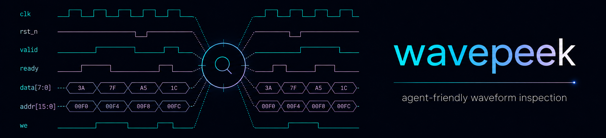

# wavepeek


[](https://github.com/kleverhq/wavepeek/actions/workflows/ci.yml)
[](https://crates.io/crates/wavepeek)

`wavepeek` is a deterministic CLI for inspecting RTL waveforms (`.vcd`, `.fst`, `.fsdb`) in scripts, CI, and LLM-driven workflows.

## Why

- In RTL debugging, waveforms are the primary artifact, but most existing tooling is GUI-first.
- LLM agents and CI jobs need short, composable commands instead of interactive navigation.
- Raw dumps (especially large waveform files) are too heavy for direct, repeated analysis in context-limited systems.
- `wavepeek` closes this gap with deterministic, bounded, machine-friendly waveform queries.

## Quick Start

Install a prebuilt VCD/FST binary.

macOS and Linux:

```bash
curl --proto '=https' --tlsv1.2 -LsSf https://kleverhq.github.io/wavepeek/install.sh | sh
```

Windows PowerShell:

```bash
powershell -ExecutionPolicy Bypass -c "irm https://kleverhq.github.io/wavepeek/install.ps1 | iex"
```

Cargo remains available as a fallback:

```bash
cargo install wavepeek
# or from source
cargo install --path .
# or with FSDB support (requires valid $VERDI_HOME)
cargo install wavepeek --features fsdb
```

Prebuilt binaries support VCD/FST.
FSDB support is source-only, Linux x86_64 only, and requires installing with the Cargo feature `fsdb` and the Synopsys Verdi FSDB Reader SDK.

Run a complete inspection flow:

```bash
# 0) Get a dump
# Note: example `.fst` dumps can be downloaded from `rtl-artifacts` releases: https://github.com/kleverhq/rtl-artifacts
WAVES=./dump.fst

# 1) Check dump bounds and time unit
wavepeek info --waves "$WAVES"

# 2) Discover hierarchy
wavepeek scope --waves "$WAVES" --tree

# 3) Find relevant signals in a scope (--filter is a regex)
wavepeek signal --waves "$WAVES" --scope top.cpu --filter '.*(clk|rst|state).*'

# 4) Sample values at one or more explicit timestamps
wavepeek value --waves "$WAVES" --at 100ns,200ns --scope top.cpu --signals reset_n,state

# 5) Inspect transitions over a time window (--on is a SystemVerilog-like clocking event expression)
wavepeek change --waves "$WAVES" --from 0ns --to 500ns --scope top.cpu --signals state --on 'posedge clk'

# 6) Check a property on selected events (--eval is a SystemVerilog-like logical expression)
wavepeek property --waves "$WAVES" --from 0ns --to 500ns --scope top.cpu --on 'posedge clk' --eval 'ready && !stall' --capture assert
```

By default, commands print human-readable output. Add `--json` for strict machine output:

```bash
wavepeek info --waves "$WAVES" --json
```

Chain commands in scripts with `jq`:

```bash
scope="$(wavepeek scope --waves "$WAVES" --json | jq -r '.data[0].path')"
wavepeek signal --waves "$WAVES" --scope "$scope" --json | jq '.data[:5]'
```

## Agentic Flows

Copy/paste this to your agent:

```text
Check whether `wavepeek` is installed:

wavepeek version

If that succeeds, run:

wavepeek skill

`wavepeek skill` prints the full packaged skill Markdown to stdout. Use that output as the source of truth and install/adapt the skill according to your own skill format and rules.
```

## Commands

| Command | Purpose |
| --- | --- |
| `info` | Print dump metadata |
| `scope` | List hierarchy scopes |
| `signal` | List signals in a scope with metadata |
| `value` | Signal values at explicit time point(s) |
| `change` | Delta snapshots over a time range with event triggers |
| `property` | Property checks over event triggers with capture modes |
| `schema` | Print canonical JSON schema used by `--json` output |
| `docs` | Browse embedded narrative docs, search topics, and export Markdown |
| `skill` | Print packaged agent skill Markdown |
| `help` | Print detailed long help for top-level or nested command paths |

Use progressive disclosure via built-in help and docs:

- `wavepeek -h` for compact lookup help
- `wavepeek --help` or `wavepeek help <command-path...>` for detailed top-level reference help
- `wavepeek docs` for embedded command guidance, workflows, troubleshooting, reference topics, and export
- `wavepeek schema` for packaged JSON contract
- `wavepeek skill` for packaged agent skill Markdown

## Development

See [CONTRIBUTING.md](CONTRIBUTING.md).

## License

Apache-2.0
